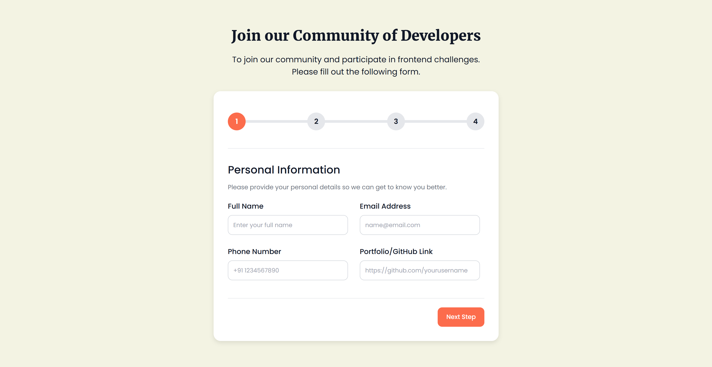

# Multi-Step Form Challenge

This repository contains a **Multi-Step Form** challenge, created as part of the **Frontend Coding Challenges**. The form guides users through different steps to collect their personal information, skills, and challenge preferences. After completing the form, users are shown a confirmation message.

## Overview

The **Multi-Step Form** is a user-friendly, interactive form that is divided into four steps:

1. **Personal Information**: Collects the user's full name, email, phone number, and portfolio/GitHub link.
2. **Skills**: Allows the user to select their skill level (Beginner, Intermediate, Advanced, Expert).
3. **Challenge Preferences**: Enables the user to select which frontend challenges they are interested in (HTML/CSS/JS, ReactJS, AngularJS, VueJS).
4. **Review and Confirmation**: Displays a summary of the user's information and allows the user to confirm the data.

Once the form is submitted, the user sees a **confirmation screen** congratulating them for successfully completing the form.

### Demo

**Screenshot**



**Live Preview**

You can also view it **Live** - [Live Demo](https://yashi-singh-9.github.io/Multi-Step-Form/)

## Features

- **Progress Bar**: Shows the user's current step and visual progress.
- **Form Validation**: Ensures that all required fields are filled out before proceeding.
- **Responsive Design**: The form adapts to different screen sizes for a seamless user experience.
- **Dynamic Summary**: In the last step, a dynamic summary of the user’s responses is displayed.
- **Confirmation Screen**: After submitting the form, a confirmation message appears.

## Installation

### 1. Clone the repository

To start, clone the repository to your local machine:

```bash
git clone https://github.com/Yashi-Singh-9/Multi-Step-Form.git
```

### 2. Install Dependencies (If Necessary)

If you are using **SCSS** and need to compile it into CSS, make sure **Node.js** and **npm** are installed on your machine. Follow the steps below to install the necessary dependencies.

#### Check if Node.js is Installed

Check if **Node.js** and **npm** are installed by running the following commands:

```bash
node -v
npm -v
```

If these commands return version numbers, you’re good to go. Otherwise, you can [download and install Node.js](https://nodejs.org/).

### 3. Install SCSS Compilation Tools

If you want to compile the SCSS files into CSS, install **Node-Sass** or **Dart-Sass** using npm.

#### Install Node-Sass

To install **Node-Sass**, run the following command:

```bash
npm install node-sass --save-dev
```

Alternatively, you can use **Dart-Sass**:

```bash
npm install sass --save-dev
```

### 4. Compile SCSS into CSS

Once you've installed the necessary tools, you can compile the SCSS to CSS:

```bash
npx node-sass style.scss style.css
```

If you are using **Dart-Sass**, the command will be:

```bash
npx sass style.scss style.css
```

To automatically compile SCSS into CSS every time you make changes, you can use the **watch** feature:

```bash
npx node-sass --watch style.scss style.css
```

If you’re using **Dart-Sass**, the equivalent command is:

```bash
npx sass --watch style.scss style.css
```

If you're using Visual Studio Code you can use **Live Sass Compiler** it can also automatically compile scss into scss.

### 5. Open in Browser

Once the SCSS is compiled into CSS, open the `index.html` file in any modern browser to interact with the form.

## Usage

Once you’ve set up the project, open the **`index.html`** file in your browser. You’ll be able to interact with the multi-step form. Here's a breakdown of the steps:

1. **Step 1**: Personal Information — Users enter their full name, email, phone number, and portfolio/GitHub link.
2. **Step 2**: Skills — Users select their skill level (Beginner, Intermediate, Advanced, Expert).
3. **Step 3**: Challenge Preferences — Users choose which frontend challenges they want to participate in (e.g., HTML/CSS/JS, ReactJS, Vue.js, etc.).
4. **Step 4**: Review — Users are shown a summary of their inputs and can submit the form.
5. **Confirmation**: After submitting, a confirmation message appears to congratulate the user for completing the form.

## Files Structure

```
multi-step-form/
├── index.html        # HTML structure of the form
├── style.scss        # SCSS for styling the form
├── style.css         # Compiled CSS file (generated from style.scss)
└── script.js         # JavaScript logic for form navigation and validation
```

### SCSS Structure

The `style.scss` file contains all the styling for the multi-step form, including:

- **Progress bar** and active step styles
- **Form step styles** for each section (Personal Information, Skills, Challenge Preferences, Review & Confirmation)
- **Responsiveness** for different screen sizes
- **Animations** and transitions to make the form more interactive

## Tech Stack

- **HTML5**: Used for structuring the form and content.
- **SCSS**: For writing modular, maintainable styles and compiling them into CSS.
- **JavaScript**: Handles form logic, including step navigation, validation, and dynamic content.
- **Font Awesome**: For icons used throughout the form.

## Contributing

Feel free to fork the repository and make improvements or suggest new features. To contribute:

1. Fork the repository.
2. Create a new branch (`git checkout -b new-feature`).
3. Make your changes.
4. Commit your changes (`git commit -am 'Add new feature'`).
5. Push your changes (`git push origin new-feature`).
6. Create a pull request.

Please ensure your code adheres to the project's coding standards and includes tests where applicable.

## License

This project is licensed under the **MIT License** - see the [LICENSE](LICENSE) file for details.

## Acknowledgments

- **Font Awesome**: For the icons used in the form.
- **Frontend Challenges**: For providing the challenge idea.
